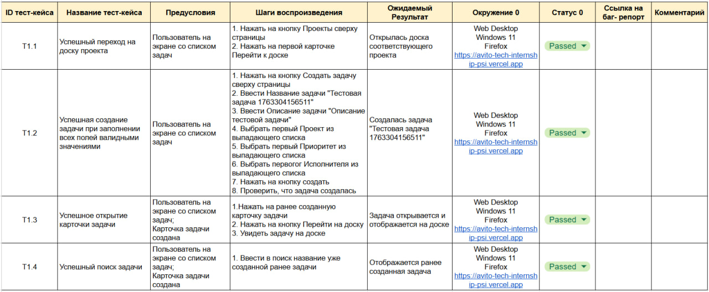

# 1. Задание в файле Task_1.docx

# 2. E2E тесты для Task Tracker

Автоматизированные end-to-end тесты для приложения Task Tracker, написанные с использованием Playwright и Allure для отчётности.

Автотесты для критических сценариев для Project Management Systems

1. Создание задачи
2. Открытие карточки задачи
3. Поиск задачи
4. Переход на доску проекта

## Требования

- Node.js (версия 18 или выше)
- npm
- Java (для генерации Allure отчётов)

## Установка

1. Клонируйте репозиторий или перейдите в директорию проекта:

```bash
cd e2e-tests_Project_Management_Systems
```

2. Установите зависимости:

```bash
npm install
```

3. Установите браузеры для Playwright:

```bash
npx playwright install
```

# Playwright тесты

## Запуск тестов

### Запуск всех тестов:

```sh
npx playwright test
```

### Запуск всех тестов в UI-режиме:

```sh
npx playwright test --ui
```

### Запуск отдельного тестового файла:

```sh
npx playwright test путь/до/файла.spec.ts
```

### Генерация allure отчёта

1. Генерация allure отчёта (с удалением старых данных):

```sh
npx allure generate ./allure-results --clean -o ./allure-report
```

2. Открытие отчёта в браузере:

```sh
npx allure open ./allure-report
```

# Тест-кейсы

## 
